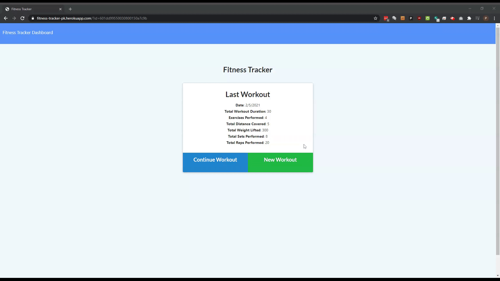

# fitness-tracker
An app for tracking daily workouts

## Description
This application is tool for tracking workouts, with separate fields for both cardio or resistance based routines.  The front-end was prebuilt in our class assignment materials using HTML, JavaScript, jQuery, chart.JS, CSS, and Bootstrap.  The back-end consists of node.js, Express, MongoDB, and Mongoose ODM.

### Functionality
* Create a new workout
* Add exercises to workout
* View statistics from your last workout
* View statistics for your last seven workouts.

### NPM Dependencies
* express
* mongoose
* morgan

[Link to the repository](https://github.com/pkriengsiri/fitness-tracker)
  
## Table of Contents
* [Installation](#installation)
* [Usage](#usage)
* [Credits](#credits)
* [License](#license)
* [Contributing](#contributing)
* [Questions](#questions)
  
## Installation
From GitHub, fork the repo and upload all contents to the deployed server.  The server must have Node.js installed. Once forked, run 'npm i' from the root directory to install required dependencies.  

Modify the `server.js` and `/seeders/seed.js` connections to match your MongoDB server configuration.   Run the `npm run seed` from the root directory to populate the database with seed data.

## Usage

Link to the deployed site: https://fitness-tracker-pk.herokuapp.com/





## Credits
Collaborators on this project included instructional staff, TAs, and students in the Georgia Tech Coding Boot Camp Winter 2020 cohort.


## License
This application is covered under MIT License

<details>
  <summary>
    License Text
  </summary> 

```

Copyright (c) 2021  Pete Kriengsiri

Permission is hereby granted, free of charge, to any person obtaining a copy
of this software and associated documentation files (the "Software"), to deal
in the Software without restriction, including without limitation the rights
to use, copy, modify, merge, publish, distribute, sublicense, and/or sell
copies of the Software, and to permit persons to whom the Software is
furnished to do so, subject to the following conditions:
      
The above copyright notice and this permission notice shall be included in all
copies or substantial portions of the Software.
      
THE SOFTWARE IS PROVIDED "AS IS", WITHOUT WARRANTY OF ANY KIND, EXPRESS OR
IMPLIED, INCLUDING BUT NOT LIMITED TO THE WARRANTIES OF MERCHANTABILITY,
FITNESS FOR A PARTICULAR PURPOSE AND NONINFRINGEMENT. IN NO EVENT SHALL THE
AUTHORS OR COPYRIGHT HOLDERS BE LIABLE FOR ANY CLAIM, DAMAGES OR OTHER
LIABILITY, WHETHER IN AN ACTION OF CONTRACT, TORT OR OTHERWISE, ARISING FROM,
OUT OF OR IN CONNECTION WITH THE SOFTWARE OR THE USE OR OTHER DEALINGS IN THE
SOFTWARE.

```
</details>


## Contributing
No contributions are being accepted at this time.
  
## Badges


## Questions
Contact me via [email](mailto:pkriengsiri@gmail.com).
View my GitHub [profile](https://github.com/pkriengsiri).